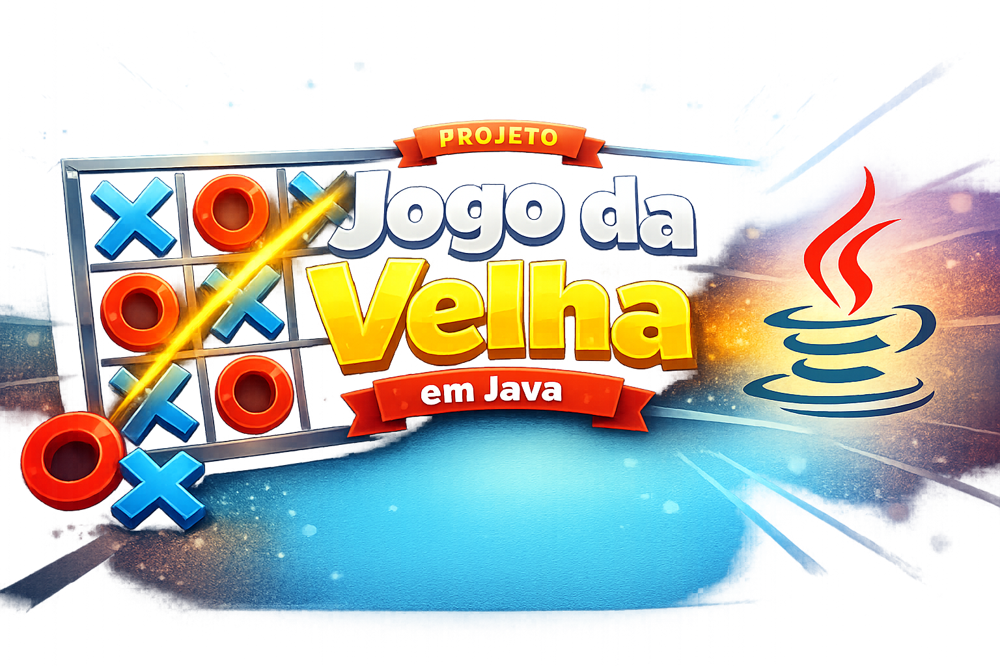

# 🎮 Jogo da Velha em Java

Projeto simples de um jogo da velha (Tic-Tac-Toe) desenvolvido em Java utilizando conceitos básicos de programação em Java.

---

## 🚀 Funcionalidades

* Tabuleiro 3x3 exibido no console
* Dois jogadores (X e O)
* Validação de jogadas
* Verificação automática de vitória
* Detecção de empate
* Alternância de jogadores

---

## 🛠️ Tecnologias utilizadas

* Java 21
* IDE IntelliJ

---

## 📌 Banner do Jogo da Velha





## ▶️ Como executar o projeto

### 1. Clone o repositorio:

```bash
git clone https://github.com/seu-usuario/jogoDaVelha.git
```
### 2. Execute o programa

```bash
java org.example.JogoDaVelha
```

---

## 🕹️ Como jogar

1. Informe o nome dos jogadores
2. O jogador X sempre começa
3. Escolha a posição informando:

   * Linha (0 a 2)
   * Coluna (0 a 2)
4. O jogo continua até vitória ou empate

---

## 🖥️ Exemplo de execução

### Entrada inicial:

```
Digite o nome do jogador 1 (X): João
Digite o nome do jogador 2 (O): Maria
```

---

### Estado inicial do tabuleiro:

```
        0     1     2
      -----------------
0->  |  -  |  -  |  -  |
      -----------------
1->  |  -  |  -  |  -  |
      -----------------
2->  |  -  |  -  |  -  |
      -----------------
```

---

### Jogada exemplo:

```
Vez de João (X)
Digite a linha (0-2): 0
Digite a coluna (0-2): 0
```

### Tabuleiro atualizado:

```
        0     1     2
      -----------------
0->  |  X  |  -  |  -  |
      -----------------
1->  |  -  |  -  |  -  |
      -----------------
2->  |  -  |  -  |  -  |
      -----------------
```

---

### Exemplo de vitória:

```
Vitória de João!
```

---

### Exemplo de empate:

```
Empate!
```

---

## 📌 Melhorias futuras

* Interface gráfica (JavaFX ou Swing)
* Modo jogador vs computador (IA simples)
* Ranking de jogadores
* Persistência de partidas

---

## 👨‍💻 Autor

Desenvolvido por Deivid Ferreira 🚀

---

## 📄 Licença

Este projeto é livre para estudos e melhorias.
